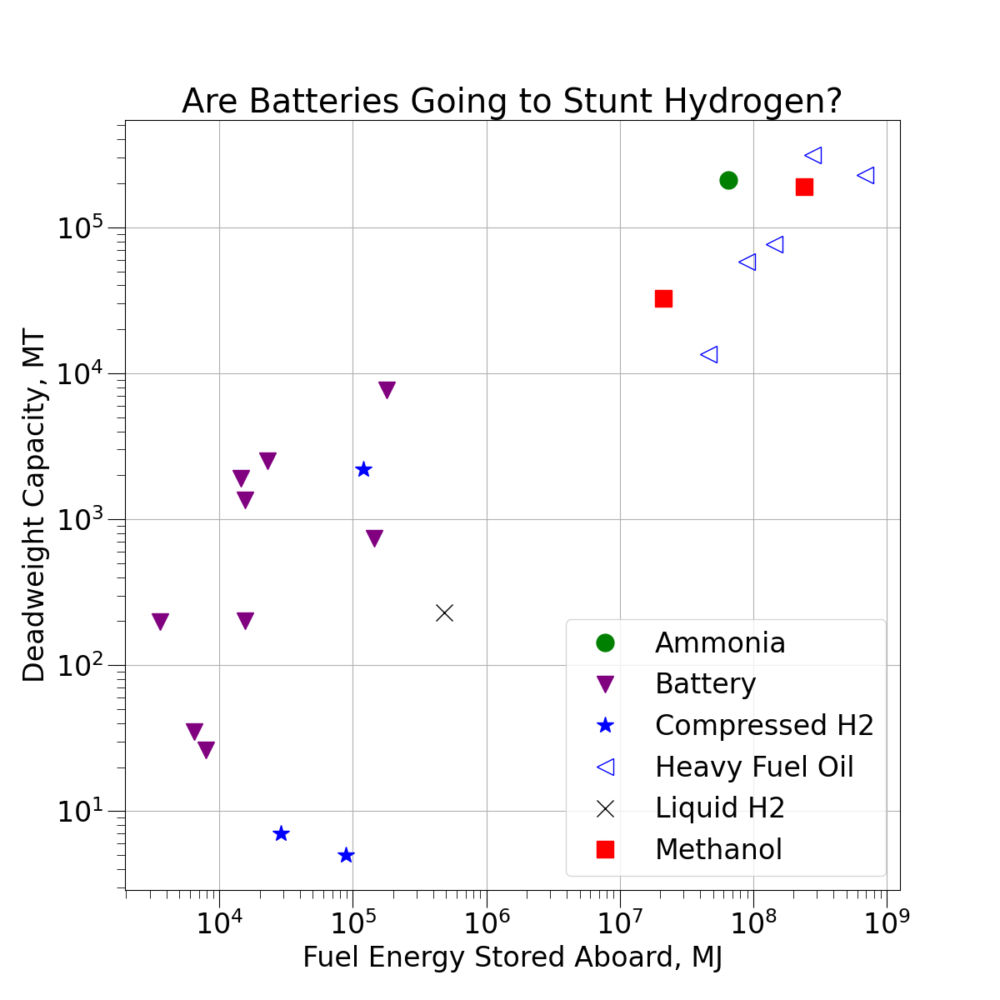

# Greenfuels
This repository consists of a data file and plotting code to examine how much energy is stored aboard ships using different fuel types.

## Structure
There are only three essential files:
* This markdown file describing the repo
* plot.py - Python plotting file, uses Pandas and Matplotlib to make plots
* current.png - Current plot (also shown at the bottom)
* shipdata.csv - Comma separated variable file with the folloing fields:
    1. Ship name - text, free-form
    2. Type of primary fuel - member of the following list:
        * Battery - for fully electric vesssel 
        * LH2 - liquid hydrogen vessel, for fuel cell ships any buffer battery is not included
        * CH2 - compressed hydrogen vessel, for fuel cell ships any buffer battery is not included
        * MDO - Marine diesel (distillate fuel)
        * HFO - Heavy (residual fuel oil)
        * Methanol 
        * Ammonia 
    3. DWT - vessel's DWT in metric tonnes, may be estimated for smaller vessel see below, and also for rules on inland or coastal tugs
    4. MJ Energy Stored - total energy in fuel, see conversions below
    5. Vessel type - one from the following list:
        * Ferry - passenger, RoRo, any type
        * Inland vessel - river-oriented vessel
        * Coastal - smaller coastal trading vessel
        * Deep ocean - Any large ocean-going commercial vessel
        * Workboat - tug, pilot, CSOV, police, patrol 
    6. Was DWT Estimated?  If 0, DWT was given in source, if 1, DWT was estimated (see below)
    7. Status - 0 indicated design/proposal/under construction, 1 indicates sailing  
    8. Source - normally a website URL for information, may also be text
    9. Notes - free form text with anything else special about the vessel

## Conversion Factors for Energy Storage
1 MWhr = 3600 MJ for batteries

For all other fuels, LHV were used.  This is imperfect for fuel cells or any WHR system that condenses vapor. 

For HFO/DO ships, weights from capacity plans were used when available, otherwise 95% filling and a S.G. of 0.94 for HFO and 0.85 for DO were used.  From capacity plans, the total energy, from both HFO and DO tanks were combined - many ships carry a small amount of DO for blending/starting etc.  For ship's estimated from class records, this level of detail was not always available. 

LHV for HFO (this assumes modern post 2020 VLSFO - older HFOs were lower) was assumed at 41.6 MJ/kg

LHV for DO was assumed at 42.8 MJ/kg

LHV for H2 is assumed at 119.96 MJ/kg

LHV Methanol is assumed at 20.1 MJ/kg, S.G. 0.79, loading was assumed possible to 95% of tank capacity in absence of a capacity plan. 

Ammonia is assumed to be carried in pressurized Type-C tanks.  A LHV of 18.8 MJ/kg is assumed with a s.g. of 0.61 for storage as a compressed liquid. 95% filling is assumed. 

## Rules of Estimated DWT

For Cosco Green Water 1, 
700 TEU @ 11 MT  + 10 Crew, food, water, effects (0.3 MT each) = 7703 MT
(it is possible the batteries aren't in the 700 TEU, but sources unclear, this could raise the DWT by another ~300 tonnes)

Rygerelektra - 297 passengers, Est 10 crew. (75kg + 10 kg per person) = 26.10 MT
Legacy of the Fjord - 400 passengers, Est 10 crew. (75kg + 10 kg per person) = 34.9 MT

Incat Hull 096 - 225 Cars @2.5 MT each, 2,130 people @ 85 Kg = 743.6 MT

H2 Barge 2 - 200 TEU @ 11 MT + 3 Crew = 2200.3 MT

MV Hydra - 80 cares @2.5 MT each, 299 + 10 people @ 85 Kg with water/effects, 4 MT LH2 = 230.3

Sea Change - 75 passengers, 5 crew @ 85 Kg each with water/effects, 242 Kg H2 = 7.042 MT

Tug - Estimated at 5, does not carry cargo

## Current Plot

